# Nykaa-like Social Commerce Platform - Comprehensive Flowchart

## Platform Overview
A beauty and wellness e-commerce platform with integrated social features, real-time chat, and product sharing capabilities.

---
#smart cart expiry validation
This feature automatically validates the expiration dates of products added to or present within the user's shopping cart in real-time. It leverages backend data that stores specific expiry dates for individual inventory items.


## 1. User Authentication & Onboarding Flow

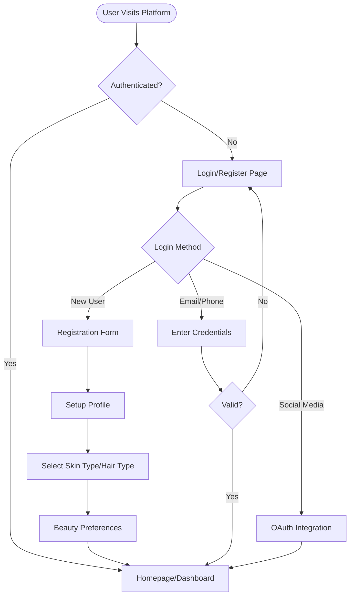

---

## 2. Core E-Commerce Features Flow

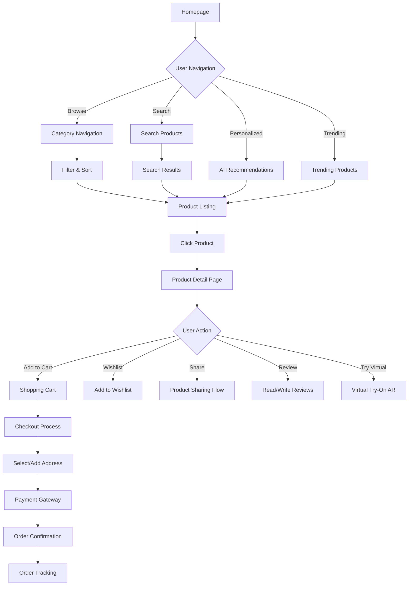

---

## 3. Product Sharing with In-Platform Chat Flow (Refined Workflow)

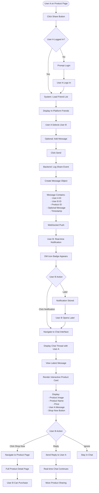

---

## 4. Real-Time Chat System Architecture

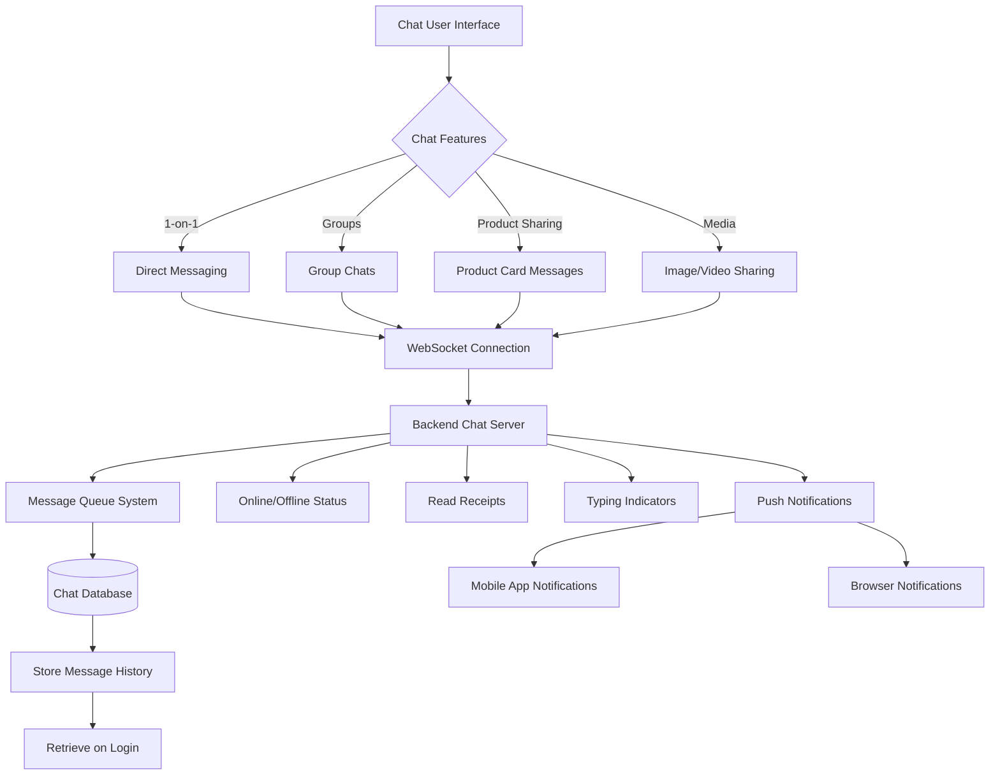

---

## 5. Social Features & User Interactions

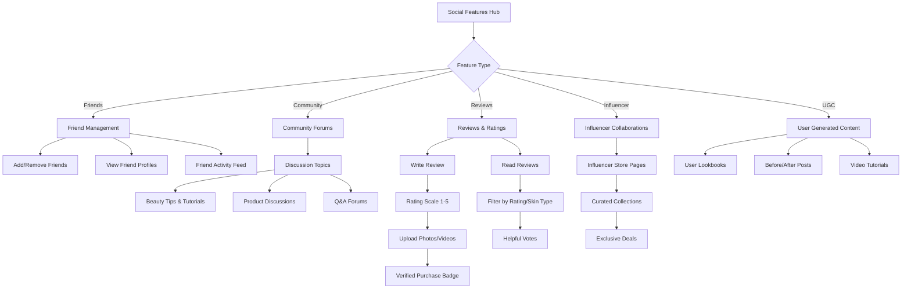

---

## 6. Personalization & Recommendation Engine

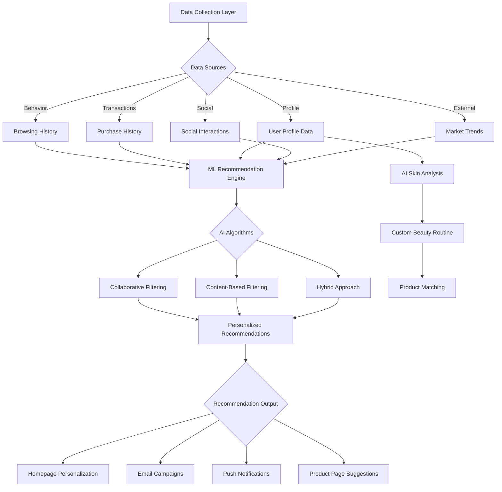

---

## 7. Order Management & Fulfillment Flow

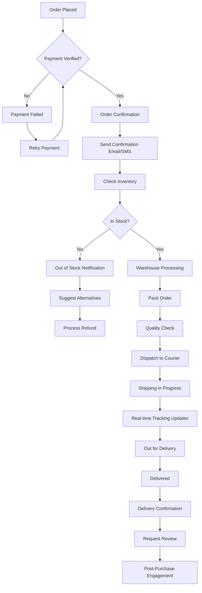

---

## 8. Admin Dashboard & Management

```mermaid
flowchart TD
    Admin[Admin Dashboard] --> Modules{Management Modules}
    
    Modules -->|Products| ProductMgmt[Product Management]
    Modules -->|Orders| OrderMgmt[Order Management]
    Modules -->|Users| UserMgmt[User Management]
    Modules -->|Analytics| Analytics[Analytics & Reports]
    Modules -->|Marketing| Marketing[Marketing Tools]
    Modules -->|Support| Support[Customer Support]
    
    ProductMgmt --> AddProduct[Add/Edit Products]
    ProductMgmt --> Inventory[Inventory Management]
    ProductMgmt --> Pricing[Pricing & Discounts]
    ProductMgmt --> Categories[Category Management]
    
    OrderMgmt --> OrderList[View All Orders]
    OrderMgmt --> OrderStatus[Update Order Status]
    OrderMgmt --> Returns[Handle Returns/Refunds]
    OrderMgmt --> Shipping[Shipping Management]
    
    UserMgmt --> UserList[View User Accounts]
    UserMgmt --> Permissions[Manage Permissions]
    UserMgmt --> Activity[Monitor Activity]
    UserMgmt --> Moderation[Content Moderation]
    
    Analytics --> Sales[Sales Analytics]
    Analytics --> UserBehavior[User Behavior Analytics]
    Analytics --> ProductPerf[Product Performance]
    Analytics --> ROI[Marketing ROI]
    
    Marketing --> Campaigns[Campaign Management]
    Marketing --> Coupons[Coupon Generation]
    Marketing --> Email[Email Marketing]
    Marketing --> SocialMedia[Social Media Integration]
    
    Support --> Tickets[Support Tickets]
    Support --> LiveChat[Live Chat Support]
    Support --> FAQ[FAQ Management]
    Support --> Escalation[Escalation Management]
```

---

## 9. Technical Architecture Overview

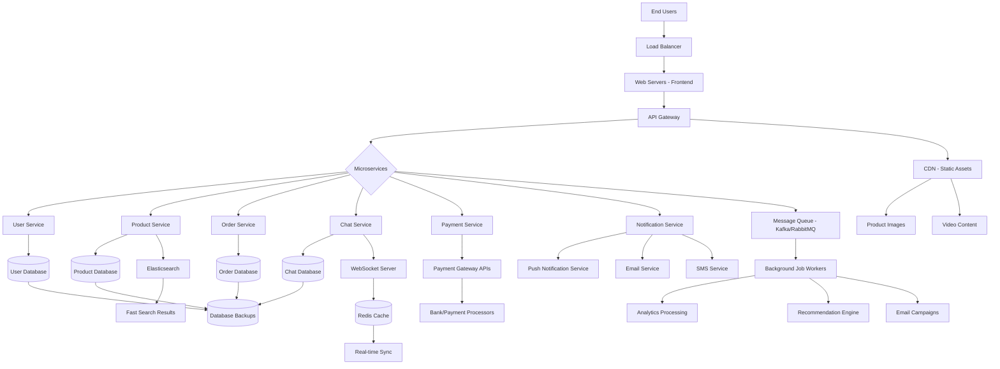

---

## 10. Mobile App Specific Features

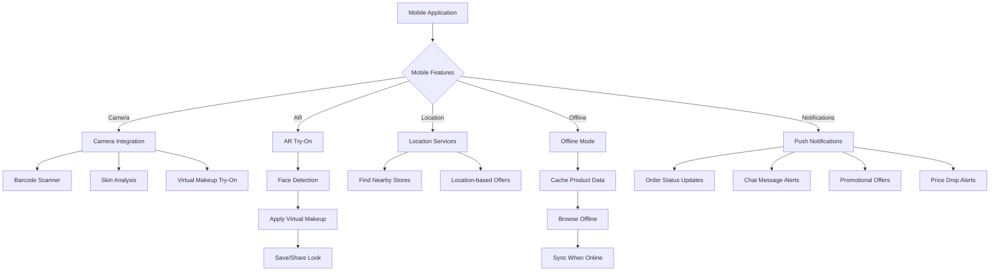

---

## 11. Security & Privacy Features

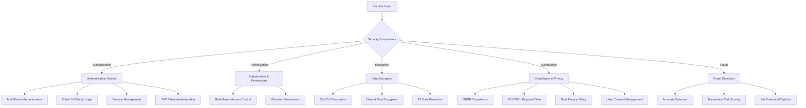

---

## Key Features Summary

### Core E-Commerce Features
- 🛍️ Product browsing and search
- 🛒 Shopping cart and wishlist
- 💳 Secure checkout and payment
- 📦 Order tracking
- ⭐ Reviews and ratings
- 🎨 Virtual try-on (AR)

### Social Commerce Features
- 💬 Real-time in-platform chat
- 📤 Product sharing via chat
- 👥 Friend system and activity feed
- 🌐 Community forums
- 📸 User-generated content
- 💄 Influencer collaborations

### Advanced Features
- 🤖 AI-powered recommendations
- 🔔 Real-time notifications (WebSocket)
- 📱 Mobile app with AR features
- 🎯 Personalized beauty profiles
- 📊 Analytics and insights
- 🔒 Enterprise-grade security

### Technical Highlights
- ⚡ Microservices architecture
- 🔄 Real-time WebSocket communication
- 📦 Redis caching for performance
- 🔍 Elasticsearch for fast search
- 📨 Message queue for async processing
- 🌍 CDN for global content delivery

---

## Product Sharing Workflow - Detailed Step Breakdown

| Step | User Action | System Process | Recipient Experience |
|------|-------------|----------------|----------------------|
| **1. Initiate Share** | User A clicks "Share" button on product page | System verifies User A's login and loads in-platform friend list | (N/A) |
| **2. Select Friends & Send** | User A selects User B and clicks "Send" | Backend logs share event and sends structured message object (User IDs + Product ID) to chat system | (N/A) |
| **3. Real-time Notification** | (N/A) | WebSockets instantly push real-time notification/badge to User B's UI | User B sees alert (DM icon badge) indicating new message from User A |
| **4. Access Message** | User B clicks notification/DM icon | System navigates User B to dedicated chat interface/thread with User A | User B sees active chat thread with conversation history |
| **5. View Interactive Product** | User B views latest message | Frontend renders message as interactive product card (image, name, price, message) | User B sees visually appealing card within conversation |
| **6. Quick Action** | User B clicks "Shop Now" button | Button triggers direct navigation to full product page URL | User B lands on product page, ready to view details and purchase |

---

## Implementation Notes

### WebSocket Integration
- Use Socket.IO or native WebSocket for real-time communication
- Maintain persistent connections for online users
- Implement reconnection logic for dropped connections
- Use Redis pub/sub for horizontal scaling across multiple servers

### Message Object Structure
```json
{
  "messageId": "unique-message-id",
  "type": "product_share",
  "senderId": "user-a-id",
  "receiverId": "user-b-id",
  "timestamp": "2025-11-25T10:30:00Z",
  "productData": {
    "productId": "product-123",
    "productName": "Luxury Moisturizer",
    "productImage": "https://cdn.example.com/products/123.jpg",
    "price": 1299.00,
    "currency": "INR",
    "productUrl": "/products/luxury-moisturizer-123"
  },
  "message": "Hey! You should try this moisturizer!",
  "status": "sent|delivered|read"
}
```

### Frontend Components
- **ChatInterface**: Main chat container with thread list
- **ProductCard**: Interactive card component for shared products
- **NotificationBadge**: Real-time notification indicator
- **FriendSelector**: Multi-select component for choosing recipients

### Backend Services
- **ChatService**: Handles message routing and storage
- **NotificationService**: Manages real-time push notifications
- **ShareService**: Logs and tracks product sharing events
- **AnalyticsService**: Tracks conversion from shares to purchases

---

This comprehensive flowchart covers all major aspects of a Nykaa-like social commerce platform with integrated real-time chat and product sharing capabilities.
